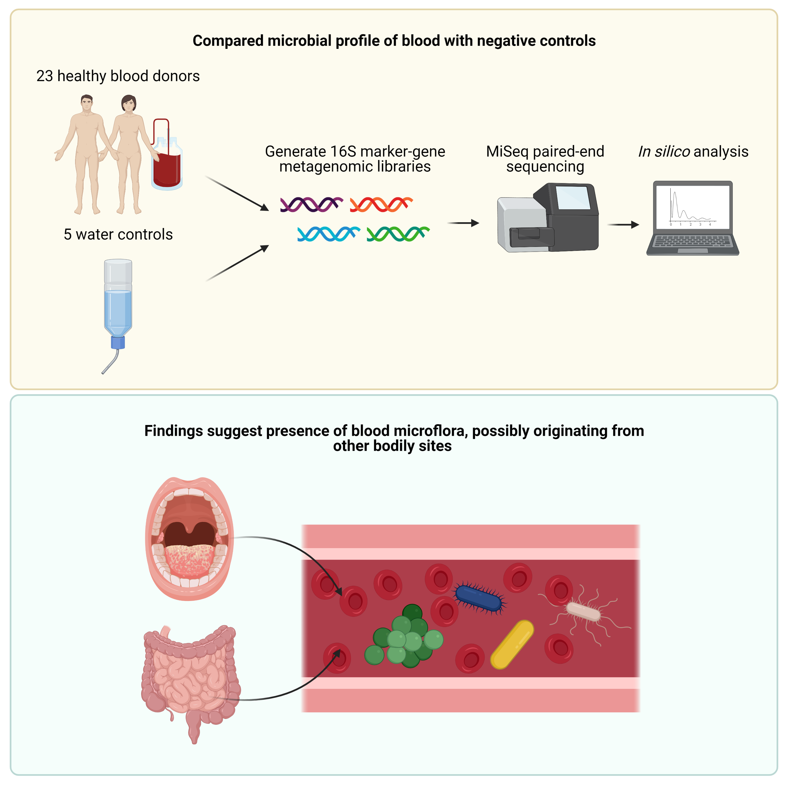

# BIOC0023: Specialist Research Project in Metagenomics (20/21)
### *University College London*

## Data pre-processing
* All preprocessing scripts can be found in the [pipeline](pipeline) and [utils](utils) directory. 
* The pre-processing pipeline was originally meant to handle shotgun sequencing single-end reads but the data used here was 16S paired-end. Hence only steps [one](pipeline/01_trim_join_qc.sh), [four](pipeline/04_kraken2_assignment.sh) and [five](pipeline/05_parse_kraken2_report.py) were used for sequencing read processing.
* 
## Data analysis
All analysis scripts are in the [analysis](analysis) directory.
* [Normalising read count matrix to yield relative abundance matrix](analysis/normalise_abundance_matrices.R).
* [Visualising per sample read count before and after processing](analysis/read_qc.R).
* [Relative abundance plots](analysis/abundance_analysis.R).
* [Rarefaction of alpha diversity](analysis/diversity_analysis.R).
* [PCoA](analysis/pcoa.R).
* [*t*-SNE + *k*-means](analysis/tsne.R).
* [RDA for identifying contamination](analysis/select_taxa.R).
## Results
Figures and the powerpoint used to annotate these figures can be found in [results](results).
